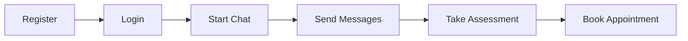

# EmotiCare API Postman Collection

## 🌟 Overview

This Postman collection provides comprehensive testing capabilities for the **EmotiCare Digital Mental Health Platform API** - a student-focused mental health support system designed specifically for Indian universities.

## 📁 Collection Contents

### 🔐 **Authentication**
- **Register User**: Create new user accounts with student profiles
- **Login User**: Authenticate and obtain JWT tokens (uses form data)
- **Get Current User Profile**: Retrieve authenticated user information

### 💬 **Mental Health Chat**
- **Start Chat Session**: Begin AI-powered mental health conversations
- **Send Message in Chat**: Continue conversations with AI support
- **Get Chat Session**: Retrieve chat history and analysis
- **Get User Chat Sessions**: List all user chat sessions
- **Get Emergency Resources**: Access crisis intervention resources

### 📊 **Mental Health Assessments**
- **Get Available Assessment Types**: List PHQ-9, GAD-7, and other tools
- **Submit PHQ-9 Assessment**: Depression screening questionnaire
- **Submit GAD-7 Assessment**: Anxiety screening questionnaire
- **Get User Assessments**: Retrieve assessment history
- **Get Specific Assessment**: View detailed assessment results
- **Get Assessment Questions**: Preview assessment questions

### 📅 **Appointments**
- **Get Available Time Slots**: Check counselor availability
- **Book Appointment**: Schedule counseling sessions
- **Get User Appointments**: View scheduled appointments
- **Cancel Appointment**: Cancel existing bookings

### 👨‍💼 **Admin Dashboard**
- **Get Dashboard Metrics**: Platform usage statistics
- **Get User Analytics**: User behavior insights
- **Get Crisis Alerts**: Emergency intervention notifications
- **Get High-Risk Assessments**: Critical assessment results

### ❤️ **Health Check**
- **Health Check**: Verify API status
- **API Documentation**: Access Swagger UI

## 🚀 Quick Start Guide

### 1. **Import the Collection**
- Download `EmotiCare_API_Collection.postman_collection.json`
- Import into Postman: `File > Import > Select File`

### 2. **Import Environment**
- Download `EmotiCare_Development.postman_environment.json`
- Import environment: `Gear Icon > Import > Select File`
- Set environment: Select "EmotiCare Development Environment"

### 3. **Start Testing**
```
1. Register User → Auto-saves user data
2. Login User → Auto-saves JWT token
3. Start Chat Session → Auto-saves session ID
4. Send Messages → Uses saved session ID
5. Submit Assessment → Auto-saves assessment ID
6. Book Appointment → Auto-saves appointment ID
```

## 🔧 Environment Variables

| Variable | Description | Auto-populated |
|----------|-------------|----------------|
| `base_url` | API base URL (http://localhost:8000) | Manual |
| `auth_token` | JWT authentication token | ✅ On login |
| `admin_token` | Admin JWT token | Manual |
| `user_id` | Current user ID | ✅ On login |
| `session_id` | Active chat session ID | ✅ On chat start |
| `assessment_id` | Latest assessment ID | ✅ On assessment |
| `appointment_id` | Latest appointment ID | ✅ On booking |

## 🎯 Testing Workflow

### **Complete User Journey**


### **Sample Test Data**
- **Email**: `newstudent@university.edu`
- **Password**: `SecurePassword123!`
- **Student ID**: `CS2025002`
- **Role**: `student`

## 🔑 Authentication Notes

### **Login Format**
⚠️ **Important**: The login endpoint uses **form data** (application/x-www-form-urlencoded), not JSON.

**Correct Format:**
```
Content-Type: application/x-www-form-urlencoded
username=newstudent@university.edu&password=SecurePassword123!
```

**Incorrect Format:**
```json
{
  "username": "newstudent@university.edu",
  "password": "SecurePassword123!"
}
```

## 📝 Assessment Scoring

### **PHQ-9 (Depression Screening)**
- **Scale**: 0-3 for each of 9 questions
- **Total Score**: 0-27
- **Interpretation**:
  - 0-4: Minimal
  - 5-9: Mild
  - 10-14: Moderate
  - 15-19: Moderately Severe
  - 20-27: Severe

### **GAD-7 (Anxiety Screening)**
- **Scale**: 0-3 for each of 7 questions
- **Total Score**: 0-21
- **Interpretation**:
  - 0-4: Minimal
  - 5-9: Mild
  - 10-14: Moderate
  - 15-21: Severe

## 🚨 Emotional States

Valid values for chat sessions:
- `very_distressed`
- `distressed`
- `neutral`
- `calm`
- `positive`

## 🛠️ Troubleshooting

### **Common Issues**

1. **401 Unauthorized**
   - Solution: Run login request to refresh token

2. **Student ID Duplicate Error**
   - Solution: Use unique student ID (e.g., increment CS2025003, CS2025004...)

3. **Invalid Emotional State**
   - Solution: Use valid emotional states listed above

4. **Login Body Not Found**
   - Solution: Ensure Content-Type is `application/x-www-form-urlencoded`

### **Server Not Running**
```bash
cd /home/cp/EmotiCare
uvicorn app.main:app --reload --host 0.0.0.0 --port 8000
```

## 🌐 API Endpoints Summary

| Method | Endpoint | Description |
|--------|----------|-------------|
| POST | `/api/v1/auth/register` | User registration |
| POST | `/api/v1/auth/login` | User authentication |
| GET | `/api/v1/auth/me` | User profile |
| POST | `/api/v1/chat/start-session` | Start AI chat |
| POST | `/api/v1/chat/sessions/{id}/message` | Send message |
| GET | `/api/v1/chat/sessions/{id}` | Get chat session |
| GET | `/api/v1/chat/emergency-resources` | Crisis resources |
| POST | `/api/v1/assessments/` | Submit assessment |
| GET | `/api/v1/assessments/` | Get assessments |
| GET | `/api/v1/assessments/types/available` | Assessment types |
| POST | `/api/v1/appointments/book` | Book appointment |
| GET | `/api/v1/appointments/my-appointments` | User appointments |

## 📞 Support & Resources

- **Crisis Hotlines**: Included in emergency resources endpoint
- **Documentation**: Available at `http://localhost:8000/docs`
- **Health Check**: `http://localhost:8000/health`

## 🎉 Success Criteria

✅ **User Registration**: Creates account with student profile  
✅ **Authentication**: Generates and uses JWT tokens  
✅ **AI Chat**: Provides contextual mental health support  
✅ **Assessments**: Scores and interprets mental health screenings  
✅ **Emergency Support**: Provides crisis intervention resources  
✅ **Appointments**: Enables counselor booking system  

---

**EmotiCare Platform** - Comprehensive Digital Mental Health Support for Indian Students 🇮🇳

*Built with FastAPI, MongoDB, Azure OpenAI GPT-4.1, and care for student mental wellness*